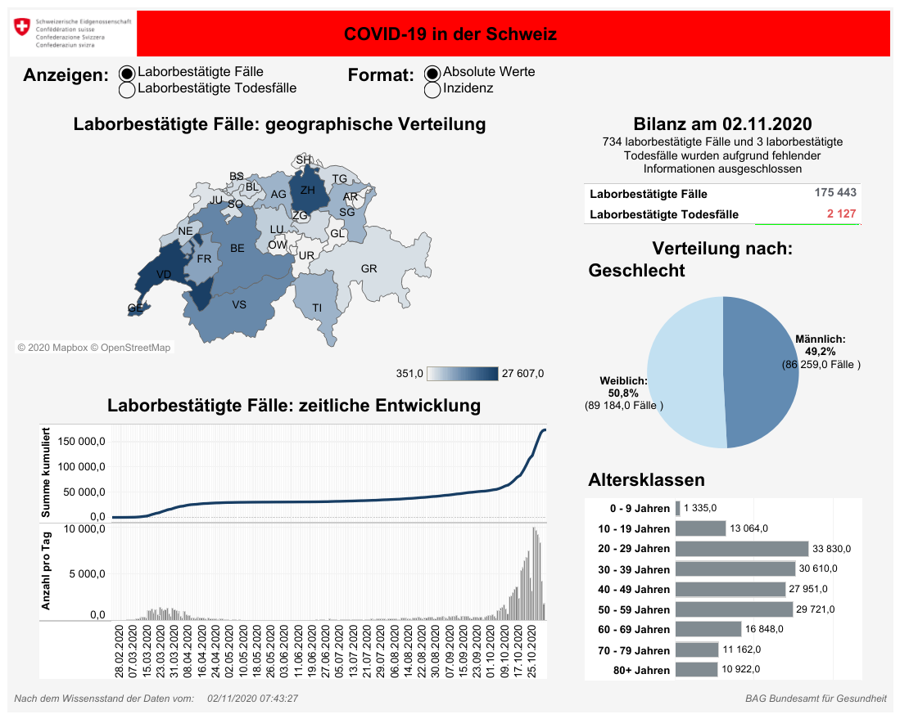

```{r setup, include=FALSE}
knitr::opts_chunk$set(echo = TRUE)
library("dplyr")
library("kableExtra")
library("stringr")
library("tidyverse")
library("plotly")
#You can set working directory to doc directory
#But this breaks some old Rstudio versions
#setwd(dirname(rstudioapi::getSourceEditorContext()$path))
```

# Intro

To show you what you can do with markdown files, I will try to reproduce the figure posted by the Federal Office of Public Health on **COVID-19** cases in Switzerland. Their website is at [https://covid-19-schweiz.bagapps.ch/de-2.html](https://covid-19-schweiz.bagapps.ch/de-1.html){.uri}.

Here is a screen shot of their website app.

```{r dashboard image, out.width = "100%", fig.align = "center"}

```

# Format the data set

Some cantons don't update their cases daily. Therefore a lot of NA entries were made.

This is not the best practice since

1. It might confuse some online trackers
2. Misleading when plotting the results

I fixed this by filling the in between entries with the nearest next entry and the NA rows before the onset of the virus with 0.

```{r load and sample data, warning=FALSE}
#load data
df <- read.csv("covid_19_data_switzerland.csv", sep=";")
df[1:10,]
#Fill missing data
df <- df %>% fill(AG:CH, .direction = c("down"))
df[is.na(df)] <- 0
df
```

# Plots

We can plot interactive plots with plotly.

```{r, fig.align = "center", warning=FALSE}
fig <- plot_ly(type = "scatter", mode = "lines")

for (i in 2:ncol(df)) {
fig <- add_trace(fig, x = df[,1],
          y = df[,i],
          data = df,
          name = colnames(df)[i],
          type = 'scatter',
          mode = 'lines')
}
fig
```

**Remember**

> Sleep is the cousin of death - Thomas Sackville, Earl of Dorset (1536-1608).
